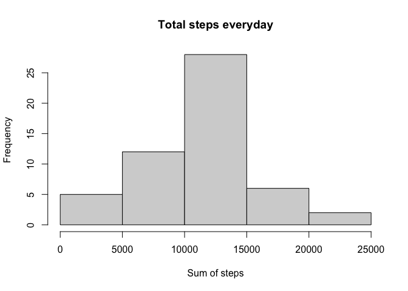
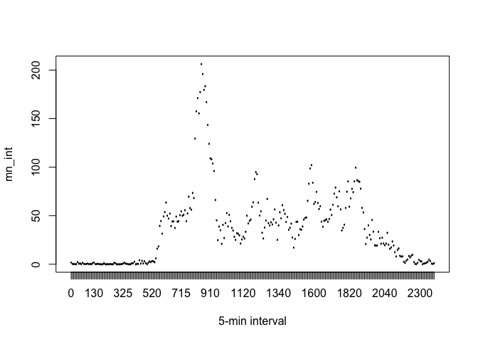
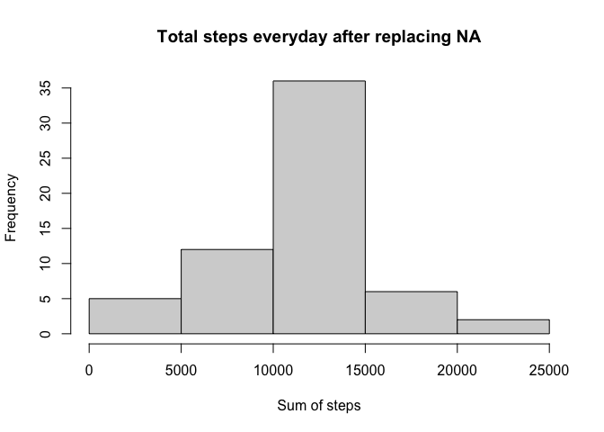
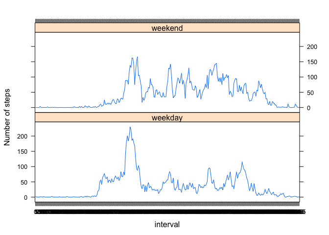

Reproducible Research: Peer Assessment 1
================

## Loading and preprocessing the data

``` r
#download data
if (!(file.exists("activity.csv"))) {
  archiveFile <- "repdata_data_activity.zip"
  if (!file.exists(archiveFile)) {
    archiveURL <-
      "https://d396qusza40orc.cloudfront.net/repdata%2Fdata%2Factivity.zip"
    download.file(url = archiveURL,
                  destfile = archiveFile,
                  method = "curl")
  }
  unzip(archiveFile)
}

#Load the data
actdata <- read.csv("activity.csv", header = TRUE , sep = ",")
actdata$date <- as.Date(actdata$date, format = "%Y-%m-%d")
actdata$interval <- as.factor(actdata$interval)

stepsday <- aggregate(steps ~ date, data = actdata, FUN = sum)
colnames(stepsday) <- c("date", "steps")
```

## Drawing Histogram for steps everyday

``` r
hist(stepsday$steps , main = "Total steps everyday" , xlab = "Sum of steps")
```

<!-- -->

## Mean and median number of steps taken each day

``` r
meansteps <- round(mean(stepsday$steps))
mediansteps <- round(median(stepsday$steps))

print(c("The mean is", meansteps))
```

    ## [1] "The mean is" "10766"

``` r
print(c("The median is", meansteps))
```

    ## [1] "The median is" "10766"

## Time series plot of the average number of steps taken

``` r
mn_int <- tapply(actdata$steps, actdata$interval, mean, na.rm = T)
plot(mn_int ~ unique(actdata$interval),
     type = "l",
     xlab = "5-min interval")
```

<!-- -->

\#\#The 5-minute interval that, on average, contains the maximum number
of steps

``` r
maxint <- mn_int[which.max(mn_int)]
```

\#\#Strategy for filling in all of the missing values in the dataset

``` r
table(is.na(actdata) == TRUE)
```

    ## 
    ## FALSE  TRUE 
    ## 50400  2304

``` r
summary(actdata)
```

    ##      steps             date               interval    
    ##  Min.   :  0.00   Min.   :2012-10-01   0      :   61  
    ##  1st Qu.:  0.00   1st Qu.:2012-10-16   5      :   61  
    ##  Median :  0.00   Median :2012-10-31   10     :   61  
    ##  Mean   : 37.38   Mean   :2012-10-31   15     :   61  
    ##  3rd Qu.: 12.00   3rd Qu.:2012-11-15   20     :   61  
    ##  Max.   :806.00   Max.   :2012-11-30   25     :   61  
    ##  NA's   :2304                          (Other):17202

``` r
#All of the NA's are in the steps variable. There are 2304 NA's.

#Strategy for filling in all of the missing values in the dataset

actdata2 <-
  actdata  # creation of the dataset that will have no more NAs
for (i in 1:nrow(actdata)) {
  if (is.na(actdata$steps[i])) {
    actdata2$steps[i] <- mn_int[[as.character(actdata[i, "interval"])]]
  }
}

summary(actdata2)
```

    ##      steps             date               interval    
    ##  Min.   :  0.00   Min.   :2012-10-01   0      :   61  
    ##  1st Qu.:  0.00   1st Qu.:2012-10-16   5      :   61  
    ##  Median :  0.00   Median :2012-10-31   10     :   61  
    ##  Mean   : 37.38   Mean   :2012-10-31   15     :   61  
    ##  3rd Qu.: 27.00   3rd Qu.:2012-11-15   20     :   61  
    ##  Max.   :806.00   Max.   :2012-11-30   25     :   61  
    ##                                        (Other):17202

\#\#Histogram of the total number of steps taken each day after missing
values are imputed

``` r
newstepsday <- aggregate(steps ~ date, data = actdata2, FUN = sum)
colnames(newstepsday) <- c("date", "steps")
hist(newstepsday$steps , main = "Total steps everyday after replacing NA" , xlab = "Sum of steps")
```

<!-- -->

\#\#Panel plot comparing the average number of steps taken per 5-minute
interval across weekdays and weekends

``` r
actdata2$weekday <- c("weekday")
actdata2[weekdays(as.Date(actdata2[, 2])) %in% c("Saturday", "Sunday", "samedi", "dimanche", "saturday", "sunday", "Samedi", "Dimanche"), ][4] <- c("weekend")
table(actdata2$weekday == "weekend")
```

    ## 
    ## FALSE  TRUE 
    ## 12960  4608

``` r
actdata2$weekday <- factor(actdata2$weekday)

activity2_weekend <- subset(actdata2, actdata2$weekday == "weekend")
activity2_weekday <- subset(actdata2, actdata2$weekday == "weekday")

mean_activity2_weekday <- tapply(activity2_weekday$steps, activity2_weekday$interval, mean)
mean_activity2_weekend <- tapply(activity2_weekend$steps, activity2_weekend$interval, mean)

library(lattice)
df_weekday <- NULL
df_weekend <- NULL
df_final <- NULL
df_weekday <- data.frame(interval = unique(activity2_weekday$interval), avg = as.numeric(mean_activity2_weekday), day = rep("weekday", length(mean_activity2_weekday)))
df_weekend <- data.frame(interval = unique(activity2_weekend$interval), avg = as.numeric(mean_activity2_weekend), day = rep("weekend", length(mean_activity2_weekend)))
df_final <- rbind(df_weekday, df_weekend)

xyplot(avg ~ interval | day, data = df_final, layout = c(1, 2), 
       type = "l", ylab = "Number of steps")
```

<!-- -->
